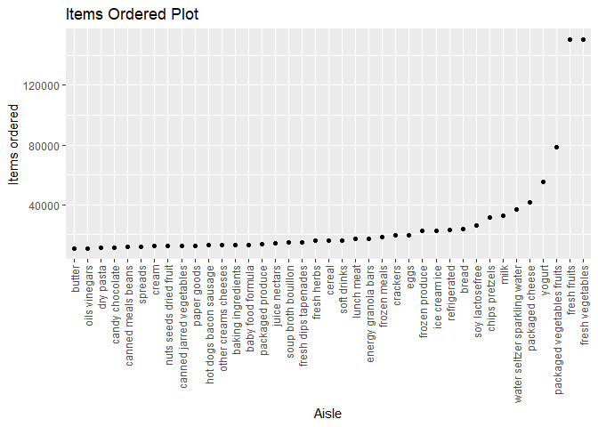
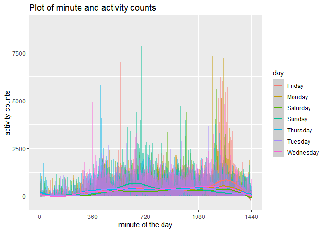
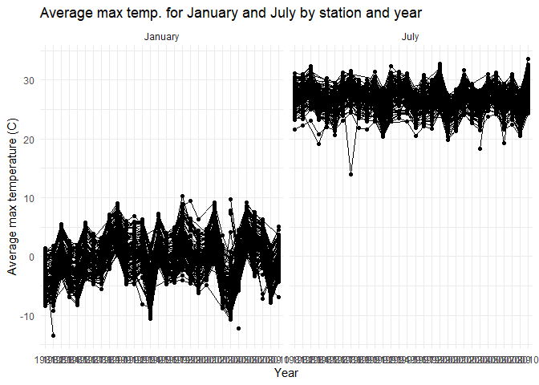
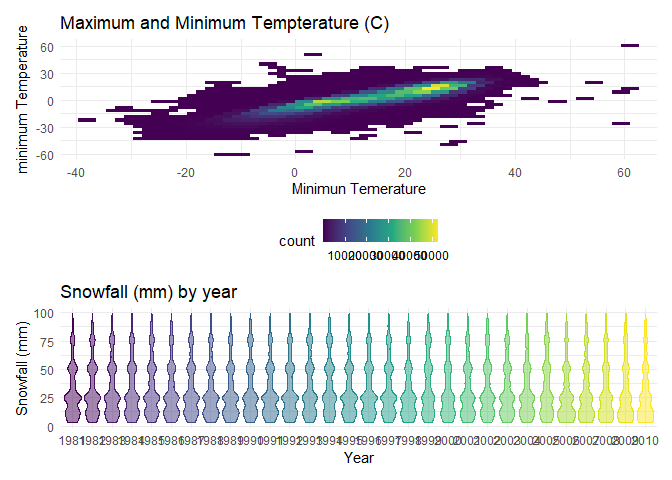

Homework 3 Solution
================
Ling Yi
10/6/2020

\#Problem 1

Loading required packages

``` r
library(tidyverse)
```

    ## -- Attaching packages ------------- tidyverse 1.3.0 --

    ## v ggplot2 3.3.2     v purrr   0.3.4
    ## v tibble  3.0.3     v dplyr   1.0.2
    ## v tidyr   1.1.2     v stringr 1.4.0
    ## v readr   1.3.1     v forcats 0.5.0

    ## -- Conflicts ---------------- tidyverse_conflicts() --
    ## x dplyr::filter() masks stats::filter()
    ## x dplyr::lag()    masks stats::lag()

``` r
library(p8105.datasets)
data("instacart")
```

How many aisles, and which are most items from?

``` r
instacart %>% 
  count(aisle) %>% 
  arrange(desc(n))
```

    ## # A tibble: 134 x 2
    ##    aisle                              n
    ##    <chr>                          <int>
    ##  1 fresh vegetables              150609
    ##  2 fresh fruits                  150473
    ##  3 packaged vegetables fruits     78493
    ##  4 yogurt                         55240
    ##  5 packaged cheese                41699
    ##  6 water seltzer sparkling water  36617
    ##  7 milk                           32644
    ##  8 chips pretzels                 31269
    ##  9 soy lactosefree                26240
    ## 10 bread                          23635
    ## # ... with 124 more rows

``` r
##most items are from fresh vegetables

instacart %>% 
  distinct(aisle) %>% 
  count()
```

    ## # A tibble: 1 x 1
    ##       n
    ##   <int>
    ## 1   134

``` r
##there are 134 distinct aisles
```

This dataset contains 1384617 rows and 15 columns. Observations are the
level of items in orders by user. There are user/order variables – user
ID, order ID, order day, and order hour. There are also item variables
–name, aisle, department, and some numeric codes.

\#\#Let’s make a plot

``` r
instacart %>% 
  count(aisle) %>% 
  filter(n>10000) %>% 
  mutate(
    aisle = factor(aisle),
    aisle = fct_reorder(aisle, n)
  ) %>% 
  ggplot(aes(x=aisle, y=n))+
  geom_point()+
  theme(axis.text.x = element_text(angle = 90, vjust = 0.5, hjust=1))+
  labs(
    title = "Items Ordered Plot",
    x = "Aisle",
    y = "Items ordered"
  )
```

<!-- -->

\#\#Making a table

``` r
instacart %>% 
  filter(aisle %in% c("baking ingredients", "dog food care", "packaged vegetables fruits")) %>% 
  group_by(aisle) %>%
  count(product_name) %>% ##This will keep aisle and counting the product name
  mutate(rank = min_rank(desc(n))) %>% 
  filter(rank<4) %>% 
  arrange(aisle,rank) %>% 
  knitr::kable()
```

| aisle                      | product\_name                                 |    n | rank |
| :------------------------- | :-------------------------------------------- | ---: | ---: |
| baking ingredients         | Light Brown Sugar                             |  499 |    1 |
| baking ingredients         | Pure Baking Soda                              |  387 |    2 |
| baking ingredients         | Cane Sugar                                    |  336 |    3 |
| dog food care              | Snack Sticks Chicken & Rice Recipe Dog Treats |   30 |    1 |
| dog food care              | Organix Chicken & Brown Rice Recipe           |   28 |    2 |
| dog food care              | Small Dog Biscuits                            |   26 |    3 |
| packaged vegetables fruits | Organic Baby Spinach                          | 9784 |    1 |
| packaged vegetables fruits | Organic Raspberries                           | 5546 |    2 |
| packaged vegetables fruits | Organic Blueberries                           | 4966 |    3 |

apples vs ice cream..

``` r
instacart %>% 
    filter(product_name %in% c("Pink Lady Apples", "Coffee Ice Cream")) %>% 
    group_by(product_name, order_dow) %>% 
    summarize(mean_hour = mean(order_hour_of_day)) %>% 
    pivot_wider(
        names_from = order_dow,
        values_from = mean_hour
    ) %>% 
  knitr::kable()
```

    ## `summarise()` regrouping output by 'product_name' (override with `.groups` argument)

| product\_name    |        0 |        1 |        2 |        3 |        4 |        5 |        6 |
| :--------------- | -------: | -------: | -------: | -------: | -------: | -------: | -------: |
| Coffee Ice Cream | 13.77419 | 14.31579 | 15.38095 | 15.31818 | 15.21739 | 12.26316 | 13.83333 |
| Pink Lady Apples | 13.44118 | 11.36000 | 11.70213 | 14.25000 | 11.55172 | 12.78431 | 11.93750 |

\#Problem 2

\#load and tidy data

``` r
acceler_df = read_csv("./data/accel_data.csv") %>% 
  janitor::clean_names() %>% 
  pivot_longer(
      activity_1:activity_1440,
      names_to = "activity_num", 
      names_prefix = "activity_",
      values_to = "activity_counts"
  ) %>% 
  mutate(
      day_binary = ifelse(day ==  "Saturday" | day == "Sunday" , "weekend", "weekday"),
      activity_counts = as.numeric(activity_counts)
  )
```

    ## Parsed with column specification:
    ## cols(
    ##   .default = col_double(),
    ##   day = col_character()
    ## )

    ## See spec(...) for full column specifications.

\#\#describing the data set

This data set contains information on five weeks of accelerometer data
collected on a 63 year-old male with BMI of 25 diagnoised with
congestive heart failure. The data set contains 50400 rows and 6
variables. The variables included in this data set are week, day\_id,
day, activity\_num, activity\_counts, day\_binary. Activity\_counts
describes the activity counts for each minute of a 24 hour day starting
at midnight and day\_binary categorizes days of the week into either
‘weekend’ or ‘weekday’.

\#\#table showing activity by day

``` r
acceler_df %>% 
  group_by(week, day) %>% 
  summarize(sum_act = (sum(activity_counts)) 
 ) %>% 
  pivot_wider(
    names_from=day,
    values_from=sum_act
  ) %>% 
  knitr::kable()
```

    ## `summarise()` regrouping output by 'week' (override with `.groups` argument)

| week |   Friday |    Monday | Saturday | Sunday | Thursday |  Tuesday | Wednesday |
| ---: | -------: | --------: | -------: | -----: | -------: | -------: | --------: |
|    1 | 480542.6 |  78828.07 |   376254 | 631105 | 355923.6 | 307094.2 |    340115 |
|    2 | 568839.0 | 295431.00 |   607175 | 422018 | 474048.0 | 423245.0 |    440962 |
|    3 | 467420.0 | 685910.00 |   382928 | 467052 | 371230.0 | 381507.0 |    468869 |
|    4 | 154049.0 | 409450.00 |     1440 | 260617 | 340291.0 | 319568.0 |    434460 |
|    5 | 620860.0 | 389080.00 |     1440 | 138421 | 549658.0 | 367824.0 |    445366 |

\#\#plot of minute and activity by day

``` r
##work on this later
acceler_df %>% 
  mutate(
    activity_num = as.numeric(activity_num)
  ) %>% 
  ggplot(aes (x=activity_num, y=activity_counts, color = day))+
  geom_line(alpha = .5)+
  geom_smooth()+
    labs(
      title = "Plot of minute and activity counts", 
      x = "minute of the day", 
      y = "activity counts"
  )+
    scale_x_continuous(
    breaks = c(0,360, 720, 1080, 1440), 
    labels = c("0", "360", "720", "1080", "1440"))
```

    ## `geom_smooth()` using method = 'gam' and formula 'y ~ s(x, bs = "cs")'

<!-- -->

\#Problem 3

``` r
data("ny_noaa")
```

\#\#clean and tidy data

``` r
ny_noaa_df = ny_noaa %>%
    separate(date, into = c("year", "month", "day")) %>% 
    mutate(
      month = as.numeric(month), 
      prcp = as.numeric(prcp),
      tmin = as.numeric(tmin),
      tmax = as.numeric(tmax),
      year = as.factor(year)
  ) %>% 
   mutate(
    tmin = tmin/10,
    tmax = tmax/10,
    prcp = prcp/10
    )
    
month_df =
  tibble(
    month = 1:12,
    month_name=month.name
  ) 
ny_noaa_df = left_join(ny_noaa_df, month_df, by = "month") %>% 
   select(-c("month")) %>% 
   relocate("id", "year", "month_name", "day")
```

\#\#common values for snowfall

``` r
theme_set(theme_minimal() + theme(legend.position = "bottom"))
options(
  ggplot2.continuous.colour = "viridis",
  ggplot2.continuous.fill = "viridis"
)
scale_colour_discrete = scale_colour_viridis_d
scale_fill_discrete = scale_fill_viridis_d
```

``` r
ny_noaa %>% 
  mutate(
    snow = as.factor(snow)
  ) %>% 
  distinct(snow) %>% 
  count()
```

    ## # A tibble: 1 x 1
    ##       n
    ##   <int>
    ## 1   282

``` r
##Add in geom smooth
```

\#\#Two panel plot

``` r
ny_noaa_df %>% 
  group_by(id, year, month_name) %>% 
  filter(month_name == "January" | month_name == "July") %>% 
  summarize(avg_max = mean(tmax, na.rm=TRUE,)) %>% 
  ggplot(aes(x=year, y=avg_max, group = id))+
  geom_point()+
  geom_path(alpha = 05, size = .3)+
  facet_grid(~ month_name)+
  labs(
    title = "Average max temp. for January and July by station and year",
    x = "Year",
    y = "Average max temperature (C)"
  )+
  theme(legend.position = "none")
```

    ## `summarise()` regrouping output by 'id', 'year' (override with `.groups` argument)

    ## Warning: Removed 5970 rows containing missing values (geom_point).

    ## Warning: Removed 5931 row(s) containing missing values (geom_path).

<!-- -->

\#\#making a hex plot

\#\#making the plot for tmin and tmax

``` r
library(hexbin)
library(patchwork)
  
tmax_tmin_plot = 
ny_noaa_df %>% 
   mutate(
    prcp = as.numeric(prcp),
    tmin = as.numeric(tmin),
    tmax = as.numeric(tmax)
  ) %>% 
  drop_na(tmax, tmin) %>% 
  ggplot(aes(x=tmax, y=tmin))+
  geom_hex()+
  labs(
    title = "Maximum and Minimum Tempterature (C)",
    x = "Minimun Temerature",
    y = "minimum Temperature"
      )
```

\#\#making the snow fall plot

``` r
snowfall_plot =  
  ny_noaa_df %>% 
  mutate(
    year = as.factor(year)
  ) %>% 
  filter(snow<=100 & snow>0) %>% 
  mutate(
    year = as.factor(year)
  ) %>% 
  ggplot(aes(x=year, y=snow, color = year))+
  geom_violin(aes(fill = year), alpha = .5)+
  theme(legend.position = "none")+
  labs(
    title = "Snowfall (mm) by year",
    x = "Year",
    y = "Snowfall (mm)"
      )
```

\#\#combining the work with patchwork

``` r
tmax_tmin_plot/snowfall_plot
```

<!-- -->
